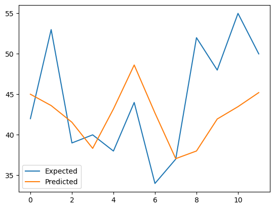

# TimeSeries-RandomForest-Female-Births
This project demonstrates a complete sequence forecasting pipeline for time-series data using Random Forest Regression.  
The time series is first transformed into a supervised learning format, enabling multi-step forecasting.   
The model is trained and evaluated using walk-forward validation, supporting both rolling window and expanding window strategies for robust cross-validation.  
Prediction accuracy is measured using Mean Absolute Error (MAE) to assess model performance over time. 
Finally, the actual vs. predicted values are visualized using Matplotlib to provide intuitive insight into forecasting quality and temporal behavior.
  
  
Implemented by @wanghii